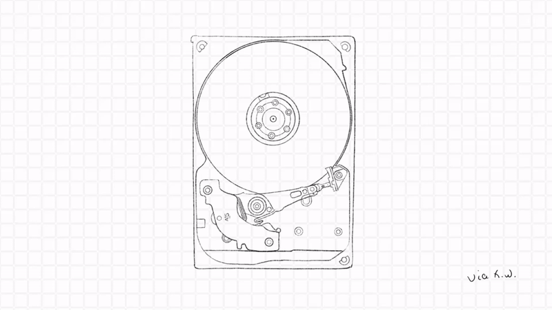
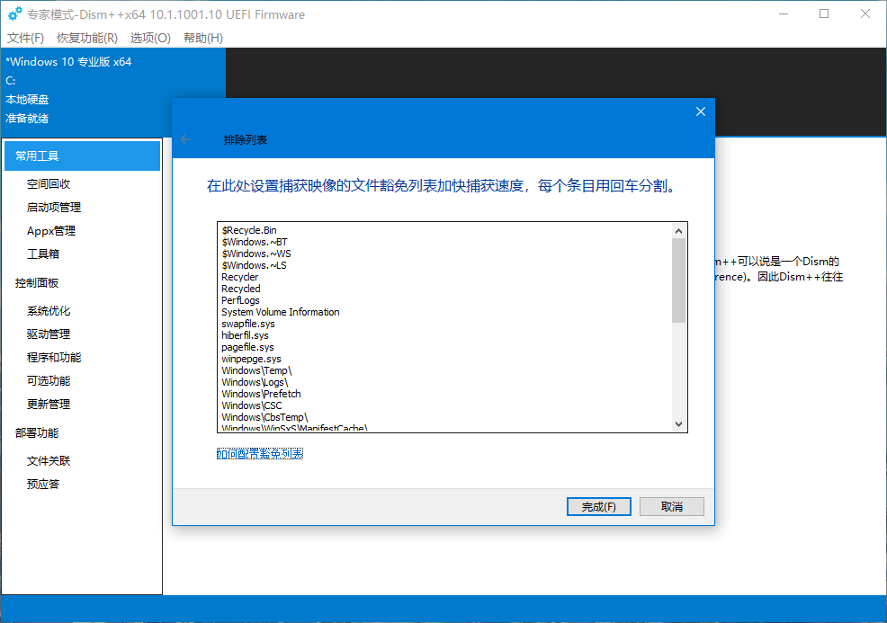
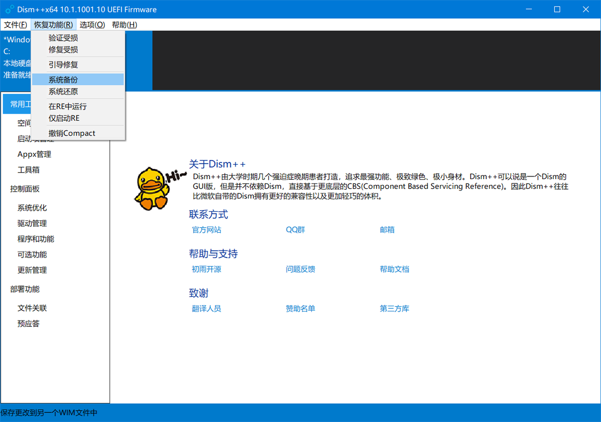
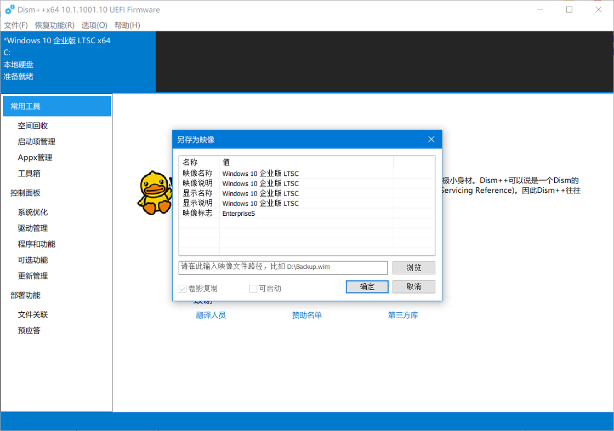
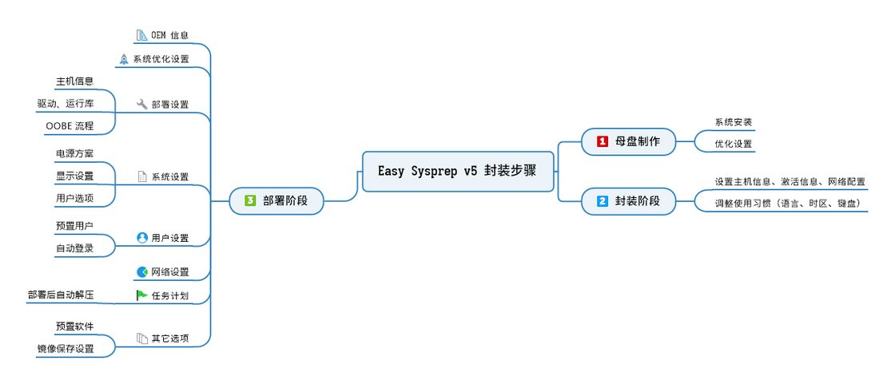
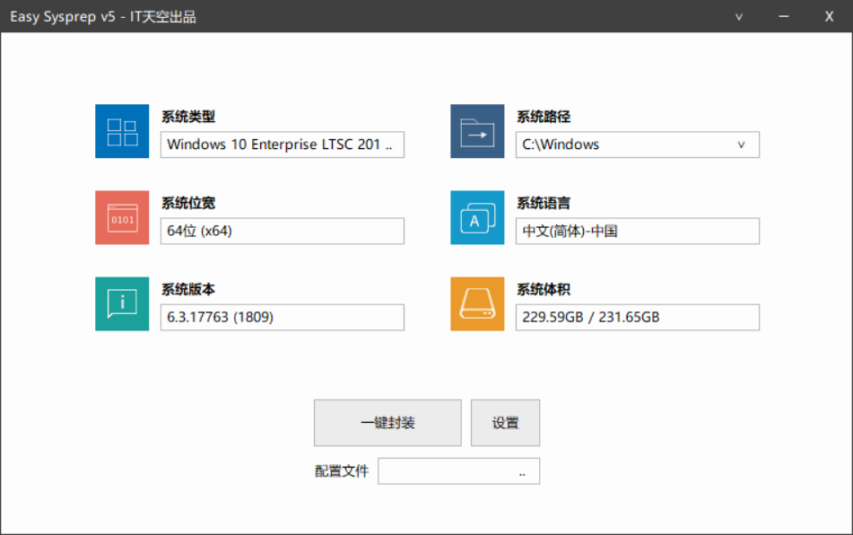
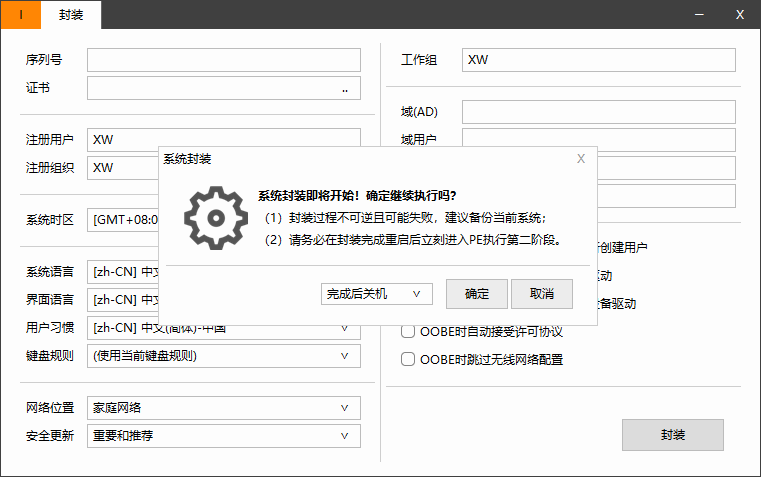
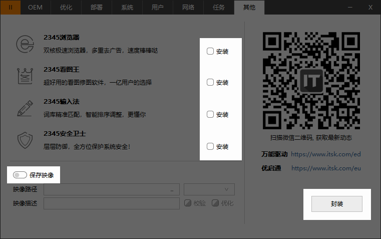
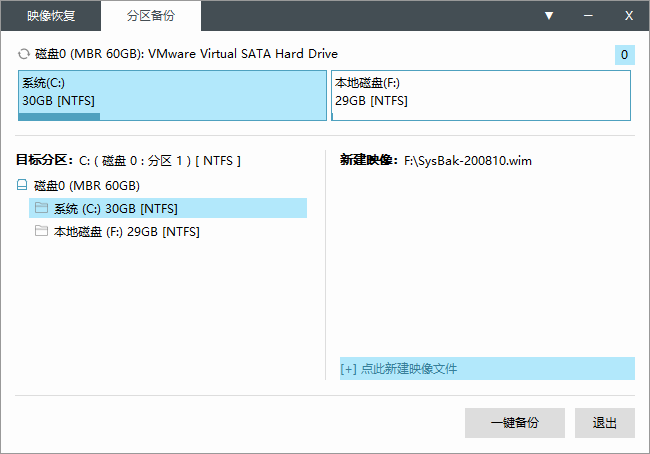
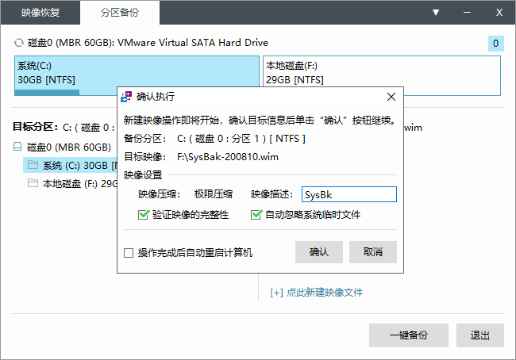

# Windows备份映像配置
当系统卡顿、出现 Bug、电脑崩坏的时候，应该重启，重装，还是重买呢？

相信大多数网友对重装并不陌生了，PE 系统、系统重置、在线重装降低了重装系统的门槛，「重装大法」虽然可以解决 90% 的问题，简单、直接，但会破坏当前熟悉的工作环境与工作流程，重装后需要花费较长的时间重新搭建，倘若操作不当，还可能丢失一些重要的工（学）作（习）资料。即便是熟悉电脑的玩家，手动恢复重装后的系统设置、硬件驱动、软件安装与配置、还原资料至可用状态，也需要耗费数小时乃至数天才能完成，让人十分头疼。

## 各类备份与恢复方式

|         |       ISO 映像       |       GHO 映像       |      WIM 映像      |      ESD 映像      |
| ------- | ------------------- | ------------------- | ----------------- | ----------------- |
| 实现原理 | 基于分区Sector-based | 基于分区Sector-based | 基于文件File-based | 基于文件File-based |
| 分区信息 | 无                  | 有                  | 无                | 无                |
| 压缩率   | 低                  | 低                  | 中                | 极高               |
| 热还原   | 不支持               | 支持                 | 间接支持           | 间接支持           |
| 热备份   | 不支持               | 支持                 | 支持               | 支持               |
| 增量备份 | 不支持               | 不支持               | 支持               | 支持               |
| 修改映像 | 不支持               | 支持                 | 支持               | 支持               |
| 便捷性   | 难                  | 易                  | 易                | 难                |

### Symantec™ Ghost
诺顿克隆精灵（Symantec Ghost），由 Binary Research 公司于 1996 年编写，后来在 1998 年 6 月 24 日被赛门铁克公司收购，扩展名为 ​gho​。2013 年 4 月 30 日起，赛门铁克将停止销售诺顿克隆向导。该软件能够完整而快速地复制备份、还原整个硬盘或单一分区。

相信许多 80 后、90 后朋友对「一键 Ghost」并不陌生 —— 蓝灰色的古老界面、黑色的小幽灵。通过将整块硬盘上的内容转换为 Ghost 映像，可以在任意电脑上实现磁盘对拷（Disk to Disk）、分区到分区（Partition to Partition）、硬盘 / 分区备份（Disk / Partition to Image）、硬盘 / 分区还原（Disk / Partition from Image）等功能。

因 Ghost 映像中未设置针对特定电脑、特定型号，无法验证还原的电脑是否为映像源的电脑，番茄花园、雨林木风、电脑公司、深度技术等公司曾借助「Ghost + 自动安装」实现傻瓜式重装，传播盗版系统，在装机圈中混得风生水起，「深受」用户们的追捧。但也因缺乏验证、无法跳过坏区块，随着微软的反击与技术更迭，Ghost 不再能胜任目前的系统备份与恢复工作。在 Symantec Ghost 退出人们的视野后，一些厂商基于映像备份的工作机制开发了适合当代系统的备份软件，如 Acronis True Image、傲梅轻松备份等，OEM 厂商也为自家的电脑配备了一键恢复系统，如联想一键恢复、Dell Factory Image Restore 等。

### WIM / ESD 映像

除了 Ghost 映像备份这种方式外，我们还能够通过 Dism 来备份映像，或是使用 Easy Sysprep 定制系统映像。

WIM（Windows Imaging Format）是一种基于文件的磁盘映像格式，由 Microsoft 设计并在 Windows Vista 后的系统使用，用于支持它们的标准安装过程。自 Windows 8 系统以来，Microsoft 又推出了一种基于文件的高压缩比磁盘映像格式 —— ESD（Electronic Software Download），随后地映像文件大多采用 ESD 格式分发。

从 Windows XP 到 Windows 10，内核由 NT 5.x 升级为 NT 6.x，映像的内部结构发生了变化，相比于 NT 5.x，NT 6.x（Windows 8 后）采用了 ESD 映像，它能储存至多 8 个 WIM 映像文件，实现在单个映像中存储多个系统版本，举个栗子 —— 在安装系统的时候，安装程序会根据激活密钥选择对应版本，如家庭版、教育版、旗舰版、企业版、工作室版等。除此以外，还可单独提取映像中的 `​source.wim`​，使用 CGI、Dism、ImageX 等工具进行安装，无需执行 Windows Setup 的流程，安装方式更加灵活。

系统封装后的映像还原方式与基于镜像的重装类似 —— 进入 PE 系统、使用映像还原工具将释放映像到系统盘、修复引导，不同的是，封装映像相比直接打包的映像多了 OOBE（Out-of-box experience）流程，用户需要填写相关信息方可进入系统。

## 镜像备份与封装备份有什么不同

从备份机制上来讲，镜像备份像是麦记的汉堡，我点了六个汉堡，生产线只会做六个给我，不会多也不会少，「点餐 - 取餐 - 开吃」，只要是选择范围内的文件，在打包时会完整地拷贝入镜像中；而封装备份好比是自助火锅，店家提供固定口味的汤底（系统），客人自选锅里的食材（驱动、系统设置、内置软件），吃完了还可以继续加，在封装系统时可以根据需要调整镜像的内容，封装完成后也可以继续修改。

## 工具介绍
### Dism++
[Dism++](https://www.chuyu.me/zh-Hans/index.html)基于比 Dism 更底层的 CBS（Component Based Servicing），为系统更新、系统修复、驱动管理、内置 / 可选功能管理、预装应用、服务管理等功能提供图形化操作，完整支持 WIM、ESD、ISO、具备相当开放的清理与优化功能。利用 Dism++ 中的系统备份功能，可为当前电脑生成备份映像。

自 Windows NT 6.x 起，系统的核心组件服务栈由 CBS（Component Based Servicing）、CMI（Component Management Infrastructure）、CSI（Component Servicing Infrastructure）、DMI（Driver Management and Install）、KTM（Kernel Transaction Manager）、SMI（Systems Management Infrastructure）六大部分组成。借助模块化的服务栈，每个系统组件需要的依赖被打包为小模组，各个模组之间相互独立，不受影响。针对不同架构的系统，使用 CBS 作为底层更具有优势 —— 无需考虑 Dism 在各个系统的兼容性（如 x86、x64、Arm 等），可脱离 Dism 依赖运行（即便是精简后的系统，也能够正常使用）。

### Easy Sysprep
Easy Sysprep 是 IT 天空出品的一款 Windows 操作系统封装部署辅助工具。它以微软系统准备工具 ​sysprep.exe​ 程序为核心，将复杂的 Windows 操作系统封装过程变得更加简单。除了直接将系统打包为映像，通过 Easy Sysprep，还可以进行一系列的优化、设置。

Sysprep 最初是为企业将系统映像部署到多台电脑中而设计，实现快速部署全新的生产环境。经过 Sysprep 初始化的电脑，除了映像内置的文件外，用户凭证、激活信息、外置设备、硬件驱动都会在封装映像时统一移除，方便后期还原至新的电脑中。

## 前期准备
镜像最重要的基础是系统，「基础不稳，地动山摇」，为了保证系统的完整性，务必使用纯净、未过度精简的系统镜像（如出厂系统盘、[MSDN iTellYou](https://msdn.itellyou.cn/) 等）。
封装环境可以分为两种 —— 基于实体机、基于虚拟机，第一种方法适用于以下情况：

1. 系统中的生产环境难以在虚拟机 / WTG 中复现，或有特定的硬件驱动、软件等；
2. 软件什么的真的太多了，重新安装十分麻烦；
3. 偷下懒。

### 材料
1. 移动硬盘 / 云盘：为了避免因为误操作导致文件丢失，务必对电脑中的重要文件进行多重备份（移动硬盘 + 云盘），备份、封装完成的映像同样需要转移至移动硬盘中；
2. PE 维护 U 盘：准备一个大小为 16G 或 16G 以上的闲置 U 盘，下载 微 PE 或 优启通 等其它安全的 PE 维护系统，按照指引制作 PE 维护 U 盘；

### 环境
1. 更新：让系统、软件保持在合适的版本；
    - 系统更新：进入「系统设置 - 更新与安全 - Windows 系统更新」，为系统安装必要的更新。
    - 驱动更新：使用驱动工具检查显卡、芯片组、网卡、声卡驱动是否需要更新。
2. 转移：移除私人文件、工作项目；
    - 备份、移除重要文件。仔细搜寻「文档」、「桌面」、「新建文件夹」等位置是否有重要文件、工作项目，如果有，务必将其转移至移动硬盘、云盘或其它安全的位置，同时进行多重备份。部分软件在运行时会在个人文件夹中存放缓存文件、配置文件，如有需要，也请一并备份与移除，避免带入映像中。
3. 清理：移除不需要的软件、垃圾；
    - 使用 Dism++ 的空间回收功能、CleanMyPC 等工具，清理系统运行时产生的日志文件、软件缓存、历史记录，保持封装时不会带入到镜像中。
    - 封装的镜像中不建议保留过多的软件，避免因镜像过大而占用过多的储存空间。只需留下硬件驱动、运行环境、常用工具、流媒体软件、工作/学习使用的软件，使用率较低的工具可以通过使用便携版（Portable Software）替代，Steam Library、移动到系统分区以外的分区中。
    - 如果使用 Dism++ 进行备份，这一步可以通过设置 ExclusionList 排除部分文件和文件夹，缩短移动文件的时间。具体用法可参照下节。
4. 优化：调整系统设置、软件设置
    - 除了在控制面板调整系统偏好，我们可以使用 Dism++、O&O ShutUp10、软媒设置助手 等工具进行设置。有关系统优化的详细设置，可以根据个人喜好调整，也可以参照以下几篇文章：

> [Eric_hong：这份 Windows 优化指南，帮你拯救越用越慢的老电脑](https://sspai.com/post/43084)
> [沨沄极客：Windows 系统不好用？让这些系统优化工具来调教它](https://sspai.com/post/42246)
> [小鱼儿yr：ES5 封装教程 - 母盘安装及系统调整](https://www.itsk.com/thread-404740-1-1.html)
> [小鱼儿yr：ES5 封装教程 - 使用工具优化与清理](https://www.itsk.com/thread-404802-1-1.html)

### 开始封装

完成以上的准备工作后，下面我们可以开始打包映像，使用 Dism++ 备份类似以前的 Ghost 备份，打开、选择保存位置、运行，如果备份的映像是个人使用，推荐使用这种方法，简单、快速。Easy Sysprep 适用于映像需要向外分发的情况，如企业内部批量重装，封装工作相比前者麻烦许多，同时因为系统封装的特殊性，如果封装的系统版本为 Windows 7 以上，需要卸载所有从 Microsoft Store 下载的应用，并使用 Administrator 用户进行封装，其余用户需要全部删除，否则会出现 0x3cf2 错误。故下文封装部分是使用虚拟机进行封装。

#### 使用 Dism++ 一键打包
首先下载 Dism++，下载后，将压缩包中的文件解压至系统盘外的位置，如 `D:\Dism_Tool`；
如果有较多文件夹不便移动，可以将文件夹路径添加至排除列表中 (菜单栏 - 详细设置 - 排除列表设置)，如 iCloud File、Tencent Files、Wechat Files。关于 ExclusionList 的高级用法可参照 [Microsoft - Dism Configuration](https://docs.microsoft.com/zh-cn/windows-hardware/manufacture/desktop/dism-configuration-list-and-wimscriptini-files-winnext)，此设置仅在 Dism 的映像备份中可用。

点击菜单栏中的「恢复功能 - 系统备份」，进入映像备份。

在文件保存对话框中，需要选择一个非系统盘的位置来保存备份映像；映像名称按照一定格式命名`（系统备份_日期_系统版本）`，如`「D:\Sys_Backup\Sys_Full_Backup-200804-Win10.wim」`；压缩率按照需要选择，映像大小与制作所需时间、压缩率成反比，压缩率越高，制作所需的时间越长，映像文件越小，这里一般选择高压缩（Wim 格式映像）即可。
一切准备就绪后，我们便可以开始系统映像的打包。点击「保存」，映像开始备份。因为等待时间比较久，推荐在晚上临睡前开始备份。
备份结束后，在 D 盘的 Sys_Backup 文件夹中找到备份的映像文件，然后将其拷贝至移动硬盘等安全的位置，需要时能够快速调用。后期如果需要修改备份映像也十分简单，在保存路径中选择先前的备份映像，Dism++ 会自动执行增量备份。

#### 使用 Easy Sysprep 定制镜像

与 Dism++ 的一把梭备份不同，系统封装会使母盘进入 OOBE 流程，同时，Sysprep 的准备阶段需要删除计算机中除 Administrator 以外的用户，并卸载所有来源于 Microsoft Store 的应用，因此封装的系统最好使用虚拟机或 WTG（Windows To Go）搭建，避免对工作环境产生影响。在对实体机系统进行全盘备份后，亦可直接进行封装（不推荐这种做法）。
虚拟机搭建有几个关键点需要留意：

> 善用虚拟机的快照备份功能，每完成一阶段后拍摄一次快照，如系统安装完成、优化完成、第一阶段完成，以便执行错误操作后方便还原；
> 因进入 PE 的入口时间只有 3 秒，在初次启动时，需进入虚拟机的 BIOS 设置调整启动顺序（CD-Rom → HDD）；
> 系统安装时、完成后需要断网安装，**请勿**安装任何系统更新；
> 实体机与虚拟机的文件交换推荐通过 U 盘进行，无需安装伺主增强工具，如 VMWare-Tools、VBoxGuestAdditions 等；
> 完成第一阶段的封装后，正确的启动顺序是进入 PE 开始部署阶段，而非虚拟机系统；

整个流程分为两大阶段，第一阶段检测系统、准备封装环境，为第二阶段奠定基础，如果出现错误提示，需要到 C:\Windows\System32\Sysprep\Panther\setuperr.log 找出错误代码进行排错。第二阶段为部署阶段，主要对母盘做出一定调整，以及设置部署时的执行任务，在 PE 系统中进行可以规避系统权限、文件占用的问题。

按照需求完成系统优化、安装后，进入封装的第一阶段。从 IT 天空论坛下载 Easy Sysprep，下载完成后，解压到分区的根目录，如` D:\Easy_Sysprep`。完成后打开` EasySysprep.exe`。

点击「设置」，调整计算机名称、使用习惯、网络设置等，然后点击封装，完成后先对虚拟机拍摄快照，随后按照提示关机，调整虚拟机的启动选项，重新启动进入 PE 维护系统。注意，关机启动后务必进入 PE 系统，否则进入系统 OOBE 流程后需要从头开始。
进入 PE 系统，打开 ES5，进入部署阶段。
按需调整目标镜像的设置，注意记得关闭Easy Sysprep的各推广选项以免目标镜像被注入流氓软件。
来到最后一步，务必关闭左下角的「保存映像」，然后点击封装按钮，结束部署阶段。

前期 ES5 对系统进行调整，接下来打开桌面的 EIX 系统安装，打包封装完成的映像，备份完后通过 U 盘等方式拷贝映像。此时，系统已被封装完成。最后一步，校验映像是否有效。重启虚拟机，系统进入 OOBE 流程，如无报错并正常进入系统，即表明映像无误。

### 还原映像
如果需要还原映像，除了可以通过先前制作的 PE 维护 U 盘进入维护系统还原，倘若先前在系统中整合了 Dism++ 的引导（选项 - 详细设置 - 勾选「整合至引导菜单」- 确定），在必要时可以进入 Dism++ on WinRE，选择对应选项操作即可。
还原映像的大致步骤如下：
> 使用 Disk Genius / 傲梅分区助手 / 磁盘管理器格式化系统分区、引导分区；
> 打开 EIX 系统安装（优启通），左侧选择映像，右侧选择还原分区，点击「一键还原」；
> 重新启动进入系统，调整设置，还原完成；
